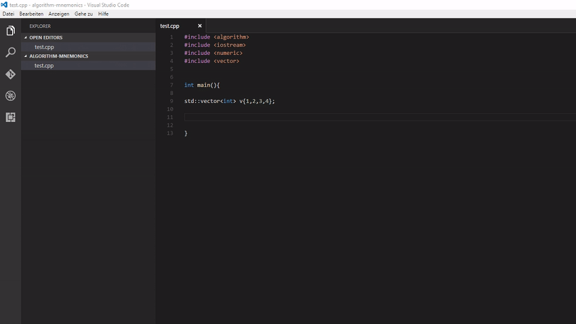

# C++ Algorithm Mnemonics for Visual Studio Code

This extension is a port of [Algorithm Mnemonics: Increase Productivity with STL Algorithms](https://github.com/tommybennett/algorithm-mnemonics) by [Tommy Bennett](https://github.com/tommybennett). 

## Features

[Algorithm Mnemonics: Increase Productivity with STL Algorithms](https://github.com/tommybennett/algorithm-mnemonics) provides code templates for C++ STL algorithms. 
Each code template is given a name and a 3-letter mnemonic (All available code templates are listed in the word document [STLInstructionSet.docx](https://github.com/tommybennett/algorithm-mnemonics/blob/master/STLInstructionSet.docx)).

This extension implements these code templates as VS Code snippets accessible by it's 3-letter mnemonic. 

## Usage
Just type the mnemonic and press Enter or Tab to expand the template. Use Tab to cycle between placeholders for inserting content.

Or use the Trigger Suggest command (Default: Ctrl+Space (Windows, Linux) or Cmd+Space (OSX)).

-----------------------------------------------------------------------------------------------------------

**Enjoy!**